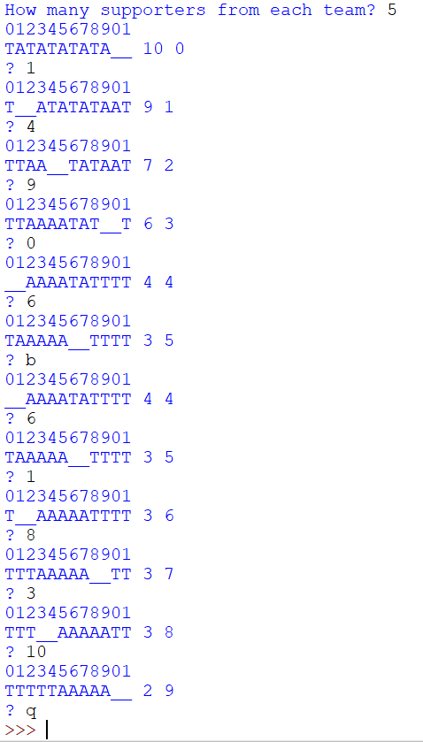

## Rationale
First assignment for CSSE1001 (Introduction to Software Engineering). Aim of the game is to get all players sitting with their respective teammates on a bench. **T**'s represent players on Team T (vice versa for **A**'s) and underscores reprsent empty seats on the bench. 

### How To Play
1. Enter integer **n** (number of players on each team). This will print a string of **n** A's, **n** T's and 2 undescores as well as 2 numbers to the right of this string. The first number is respresents the number of players not sitting next to a player from the same team (players sitting next to empty seats are also counted in this number due to the requirements of the assignment, so 2 is the lowest possible value). The second number of the number of moves you have entered. Over this string is the seat positions on the bench (First 0-9 positions are integers 0,1,..,9. Next 0-9 positions are integers 10,11,..,19 and so on).
2. Enter a seat number **x** of a player (integer). The players in seats **x** and **x + 1** will be moved to the empty seats (represented by underscores) and their seats will become vacant.
3. Keep entering seat numbers until all players on Team A are sitting in consecutive seats and all players on Team T are sitting in consecutive seats (for example, `TTTTT__AAAAA` or `AAAAATTTTT__` are possible end states).
4. Enter **b** to undo your last move and **q** to quit the game.

### Screenshots

